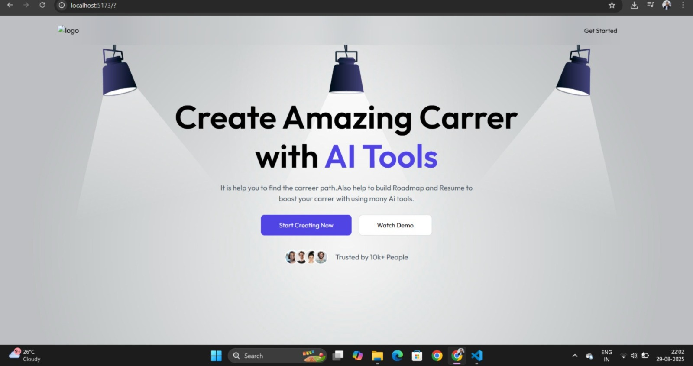

#  🎯 AI-Powered Career Roadmap & Resume Generator

## 📌 Project Overview
This project is an **AI-powered web application** that helps students plan their career path and build an ATS-friendly resume.  


Students provide their **personal details, education, and skills** → The system generates:
- A **personalized career roadmap** (skills to learn, projects, certifications, strengths/weaknesses).
- An **ATS-optimized resume** tailored to their target role, downloadable as PDF.

This is the **MVP (Phase 1)** of a larger platform that will later include:
- Job recommendations (using RAG on scraped job data)
- Mock interview practice with AI
- AI mentor chatbot for career guidance

---
## 🚀 Features
- 🔑 User Authentication (Signup/Login)
- 📝 Form to collect user details (personal info, education, skills, interests)
- 🤖 AI-generated **career roadmap** (phased plan with skills, projects, certifications)
- 📊 Career strengths & weaknesses analysis
- 📄 AI-generated **ATS-friendly resume (PDF download)**
- 🎨 Clean, responsive UI (React + Vite)
- Fully Dockerized for deployment

---

## 🏗️ Tech Stack

### Frontend
- **React.js (React framework)** → Routing & UI
- **TailwindCSS + Shadcn UI** → Styling & components
- **Recharts / Chart.js** (later for roadmap visualization)
- State Management → Zustand / Redux Toolkit

### Backend
- **Django + DRF** → REST API layer
- **PostgreSQL (Supabase/Railway)** → User & roadmap data storage
- **JWT Auth** (djangorestframework-simplejwt)

### AI/ML Layer
- **FastAPI Microservice** → Handles AI logic
- **OpenAI GPT API / Claude** → LLM for roadmap + resume generation
- **ReportLab / python-docx** → Generate downloadable PDF resumes
- **PyMuPDF / spaCy** (future for resume parsing)

### Deployment
- **Frontend** → Vercel
- **Backend** → Render / Railway (Dockerized)
- **Database** → Supabase (PostgreSQL + storage)
- **AI Service** → Render / Railway (FastAPI container)

---
## 🔄 System Flow (Feature 1: Roadmap + Resume)

1. **User visits homepage** → clicks "Generate Roadmap"
2. Redirected to **Signup/Login** page
3. User fills **form** (personal info, education, skills, interests)
4. Form data sent to **Django backend API**
5. Backend forwards data to **AI Microservice (FastAPI)**
6. AI Microservice:
   - Uses **LLM** to generate structured **career roadmap JSON**
   - Creates an **ATS-friendly tailored resume** → exports PDF
7. Backend stores roadmap + resume metadata in DB
8. Frontend dashboard displays roadmap, strengths/weaknesses, and resume download option

---

## 📊 Architecture Diagram (MVP)

```mermaid
graph TD
    A[Frontend (Next.js)] -->|Forms Input| B[Backend (FastAPI)]
    B -->|API Calls| C[AI Service (LLM / ML Models)]
    C -->|Results JSON| B
    B -->|Processed Data| D[Database (PostgreSQL / MongoDB)]
    B -->|Responses| A
```
## 📂 Project Structure

```bash
  stock-dashboard/
    ├── Backend/ # FastAPI backend
    ├── Frontend/ # React frontend
    ├── ai_service
    ├── docker-compose.yml
    └── README.md
```
## 🔧 Local Development

## Clone the repo
```bash
git clone https://github.com/Himanshukabsuri/CareerCraft.git
cd stock-dashboard
```
## Frontend Setup
```bash
cd Frontend
npm install
npm run dev
```
## Backend Setup
```bash
cd Backend
pip install -r requirements.txt
python manage.py migrate
python manage.py runserver

```
## AI Service Setup
```bash
cd ai_service
pip install -r requirements.txt
uvicorn main:app --reload

```


 - Backend: http://localhost:8000

 - Frontend: http://localhost:3000
 


# 🌍 Deployment
 - Backend: Deploy /backend to Render

 - Frontend: Deploy /frontend to Vercel

---

## 📸 Screenshots

### Home Page



## 🚀 Features Scope (Phase 2 & Beyond)
- 🔍 AI-powered job & internship recommender (LinkedIn/Indeed scraping + RAG with embeddings)
- 🎤 AI mock interview bot (role-specific Q&A with feedback)
- 🧑‍🏫 AI career mentor chatbot
- 📈 Progress tracker with weekly learning goals
- 🌐 Social login (Google, GitHub)
- 🏆 Leaderboard / student showcase community

---

## 👨‍💻 Team Roles
- Frontend Devs → React.js, UI/UX
- Backend Devs → Django, API, DB
- ML Developer → AI Service (LLM, Roadmap, Resume Generator)
- Deployment → CI/CD, cloud infra

--- 
## License

[MIT](https://choosealicense.com/licenses/mit/)

